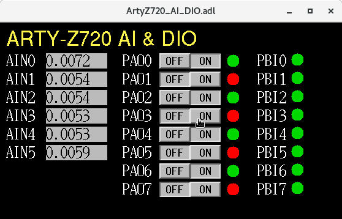

# SoftIOC on zynq FPGA

----------
This work introduces how to build softIOCs on a PYNQ based Arty-Z7 board 
to read and set the Arduino and PMOD IOs.
The objects include:
- configure the Arty-Z7 board as an IOC server;
- enable the readback of analog inputs and digital I/Os;
- simplify the work in developing the drivers and the IOC database.

To achieve these objects, one solution is to deploy the `pynq + pythonSoftIOC`. 
By employing `pynq` module in python, the access to the GPIO readback/setting 
can be done in a one-line python code, so that one can get rid of the driver
development and the HDL programming. 
This README introduces how to install `PYNQ` (an linux enbeded ubuntu with python) 
configure the Arty-Z7 board for network access, and install the `pythonSoftIOC`. 
A demo python script is included, it creates a number of PV channels to read and set
a series pin status.

Hardware used:
- [Arty Z7-20](https://digilent.com/shop/arty-z7-zynq-7000-soc-development-board)
- 16 GB micro SD card
- Ethernet cable (connect to the network)
- USB A to Micro-B Cable (serial communication between the board and computer)

Software required:
- PYNQ (ubuntu core based OS)
- python>3.7
- modules
  - pynq 
  - pythonSoftIOC
  - pyepics [optional]

----------

## 1. PYNQ
The PYNQ framwork runs on the underlying OS of Ubuntu. By depolying
the PYNQ on the Arty Z7 board, an Ubuntu OS is running on the board.
Therefore, the speed of the accessing an IO port on board will be 
slower than that HDL programed. But it can be used for prototype 
test or for the small projects that are non-critical in time, 
for example, response time > 10ms.


### 1.1 Setting up PYNQ (Ubuntu)
To get started the first thing we need is to download the 
[PYNQ image](https://bit.ly/pynqz2_v3_0_1) from 
http://www.pynq.io/board.html, at the time of writing Version 3.0.1 
is the latest release. Here we are going to download the PYNQ-Z1 
image that is compatible with our Arty Z7 board.

Once downloaded, the image should be burn onto a SD card. 
A minimal size of 16 GB is suggested because the image will take 
about 7 GB,
and more space is needed for EPICS.
The software [WinDisk32](https://sourceforge.net/projects/win32diskimager/) 
can be used to flash the image in Windows OS. 
Note: Flashing the SD card will erase everything, so Make sure you
don't have anything on the SD card.

After the flashing process has completed, remove and insert the card into 
the Arty Z7.
Make sure that the Boot Jumper **JP4 is set to SD**. 
Plug in Arty and wait for the Pynq image to Boot.

### 1.2 IP configuration
#### 1.2.1 Assign stastic IP address for the FPGA
edit the `/etc/network/interfaces.d/eth0` file to change the IP setting. 
An example setting in one of the FPGA is as following
``````
auto eth0
    iface eth0 inet static
    address 10.XXX.XX.XXX
    netmask 255.255.255.0
    gateway 10.XXX.XX.1
    dns-nameservers 152.X.XX.XXX 8.8.8.8
``````

#### 1.2.2 Configure nameserver
edit `emacs /etc/resolvconf/resolv.conf.d/head`, and add the nameservers in this file.
```
nameserver 152.3.70.100
nameserver 8.8.8.8
```
where `152.X.XX.XXX` is the name server at Duke and `8.8.8.8` is the name server of Google.

Another tempery change of nameserver is to edit the `/etc/resolv.conf` to enable the nameserver and search domains, 
an example is shown as following:
```
nameserver 152.X.XX.XXX 8.8.8.8
options edns0 trust-ad
search DOMAINS fel.duke.edu
```

#### 1.2.3 Serial communication with the linux terminal
when use `minicom` in the terminal for serial communication, error occurs as follows
```
Cannot create lockfile for /dev/modem: No such file or directory
```
in this case, use the 
```
> minicom -D /dev/ttyUSB1
```
to talk to the right serial port.

### 1.3 Access the Ubuntu on Arty-Z7
In this example, the IP was not reconfigured, the default IP address is 
`192.168.2.99` by default. It can be accessed with *ssh*. 
The default *username* and *password* are *xilinx*.
The default password of root is also *xilinx*.
Create an *epics* directory under */home* using *root*
```
> ssh xilinx@192.168.2.99 
> su root
> mkdir /home/epics/
> cd /home/epics/
```
or
```
> ssh root@192.168.2.99
> mkdir /home/epics
> cd /home/epics/
```
### 1.4 Configure the environment variable `PATH` for `sudo` user
Running a python script with some function of `pyqn` might fail 
due to the lack of the root permission.
However, running with `sudo` might also report an error of the 
lack of module `pyqn1. 
```
xilinx@pynq:~/pythonSoftIOC$ sudo ./demo1.py
[sudo] password for xilinx: 
Traceback (most recent call last):
  File "/home/xilinx/pythonSoftIOC/./demo1.py", line 8, in <module>
    from pynq.overlays.base import BaseOverlay
ModuleNotFoundError: No module named 'pynq'
```
This is due to the different set of environment variables in `sudo` or `root` users. 
It can be check as follows:
```
xilinx@pynq:~/pythonSoftIOC$ env | grep PATH
PATH=/opt/sigrok/bin:/usr/local/share/pynq-venv/bin:/opt/sigrok/bin:/opt/microblazeel-xilinx-elf/bin:/opt/python3.10/bin:/usr/local/sbin:/usr/local/bin:/usr/sbin:/usr/bin:/sbin:/bin:/usr/games:/usr/local/games:/home/epics/base/bin/linux-arm
xilinx@pynq:~/pythonSoftIOC$ sudo env | grep PATH
PATH=/opt/sigrok/bin:/opt/microblazeel-xilinx-elf/bin:/opt/python3.10/bin:/usr/local/sbin:/usr/local/bin:/usr/sbin:/usr/bin:/sbin:/bin:/usr/games:/usr/local/games
```
The directories `/usr/local/share/pynq-venv/bin:` and 
`/home/epics/base/bin/linux-arm` are not included in the `PATH` of `sudo` user. 
They can be added by editting and adding them to the `PATH` in the file 
`/etc/environment`.
```
xilinx@pynq:/etc$ sudo emacs environment
```


## 2. Install pythonSoftIOC
Installation of the pythonSoftIOC module can be found 
[here on the github](https://dls-controls.github.io/pythonSoftIOC/master/tutorials/installation.html).
This module enables us to build the record && database in python.

It requires python3.7 or later. The version can be checked in terminal
```
> python3 --version
```
the library can be install with `pip`
```
> python3 -m pip install softioc
```
Other modules can be installed in a similar way, for example, `cothread`
```
python3 -m pip install cothread
```

If interfaces with other pv channnels are needed,
another module named `pyepics` can be installed.
Instructions can be found [here](https://pypi.org/project/pyepics/). [optional]
```
> pip install pyepics
```

## 3. Demo code
After the installation is finished, the attached demo code,
`demoIOC_ArtyZ7.py` can be run. It creates a softIOC running 
- 6 analog inputs (cooresponding to A0-A5 of Arduino) 
- 8 bool output (PMODA port)
- 8 bool input (PMODB port)

Make sure you are running as root, and it requires python>3.7.
Change the head in the `demo.py` to point to python3 if needed.

Allow the execute  permission of the `demo.py`.
```
chmod +755 demo.py
```
Excute the script.
```
root@pynq:/home/xilinx/pythonSoftIOC# ./demo.py
Starting iocInit
############################################################################
## EPICS 7.0.7.0
## Rev. 7.0.7.99.0.0
## Rev. Date 7.0.7.99.0.0
############################################################################
iocRun: All initialization complete
Python 3.10.4 (main, Apr  2 2022, 09:04:19) [GCC 11.2.0] on linux
Type "help", "copyright", "credits" or "license" for more information.
(InteractiveConsole)
>>> 
```
Add the server into your `EPICS_CA_ADD_LIST`. Temporary changing can be done 
with
```
setenv EPICS_CA_ADDR_LIST=192.168.2.99 # ip address of the board
```
Now you the PV channels should be accessable from EPICS.
Pannel monitor can be found in `./opi/`, by running
```
medm -x ArtyZ720_Main.adl
```
and click on `Arty-Z720 AI_DIO` button. The panel looks like following:



## 4. Compile EPICS base [optional]
If you are interested in developing IOC using conventional method instead of using 
`pythonSoftIOC`, the EPICS base can be compiled. 
In this demo, [base-3.15.9](https://epics.anl.gov/download/base/base-3.15.9.tar.gz)
is used. Download the base archived package.
```
> wget https://epics.anl.gov/download/base/base-3.15.9.tar.gz
> tar -xvf base-3.15.9.tar.gz
```
Compile process refer to the [EPICS base installation instructions](https://epics.anl.gov/base/R3-15/9-docs/README.html).
The version of *make*, *gcc*, *g++* should be checked before compiling.
One thing that should taken care of is to set the *EPICS_HOST_ARCH=linux-arm*
before running *make distclean* and *make*. Otherwise, error would be reported.

Edit the `~/.bashrc` (or `~/.cshrc`, depends on the default shell used), 
add the following line to the file:
```
> export EPICS_HOST_ARCH=linux-arm
> export PATH="$PATH:/home/epics/base/lib/linux-arm"
```
Clean and compile the EPICS base
```
> ln -s base-3.15.9 base
> cd base
> sudo make clean
> sudo make
```
It may take a while for the compilation.
After the compilation, check if the `caget, caput` are in the `path`, 
and run the softIoc to see if it works
```
> which caget
> which caput
> cd db 
> softIoc -d softIocExit.db
```


# reference
- [Python productivity for Zynq (Pynq)](https://pynq.readthedocs.io/en/v2.0/index.html#)
- [pythonSoftIOC](https://dls-controls.github.io/pythonSoftIOC/master/index.html)
- [pyepics](https://pypi.org/project/pyepics/)
- [epics base 3.15.9](https://epics.anl.gov/base/R3-15/9.php)
